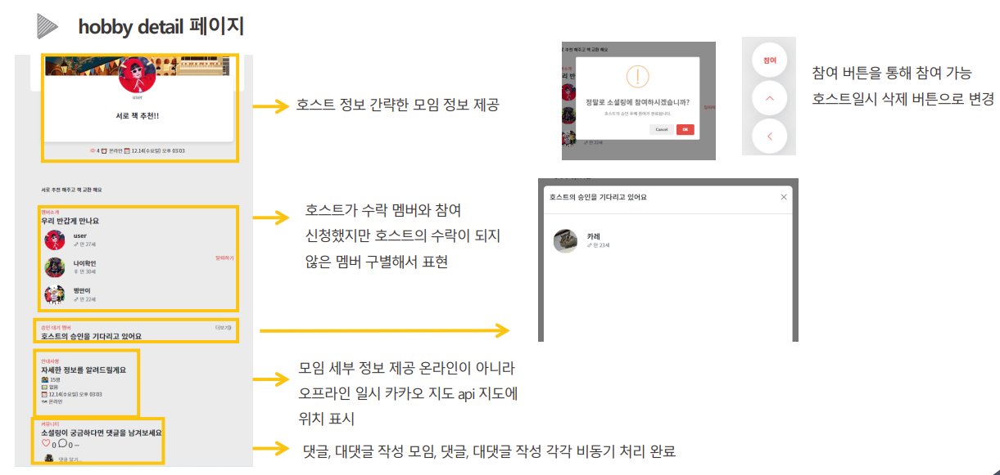
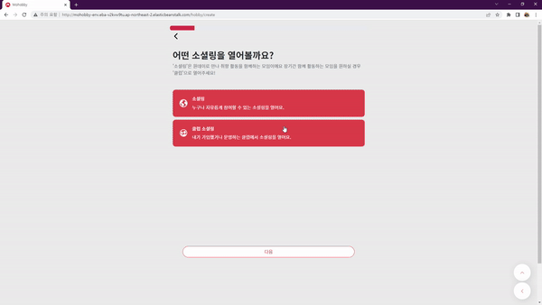
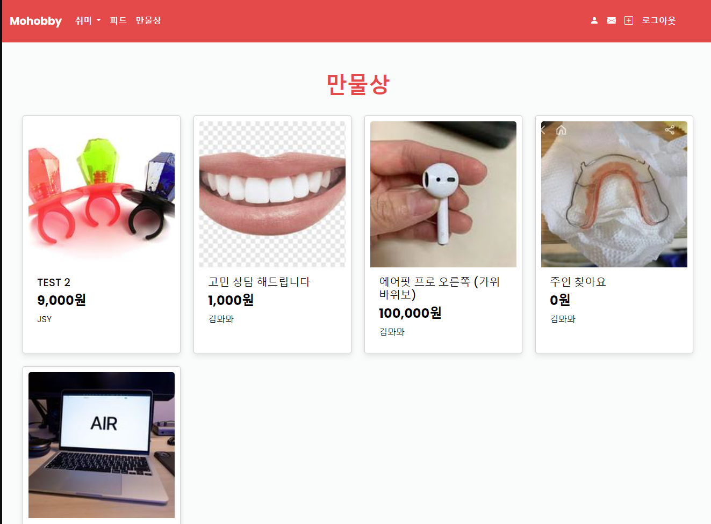
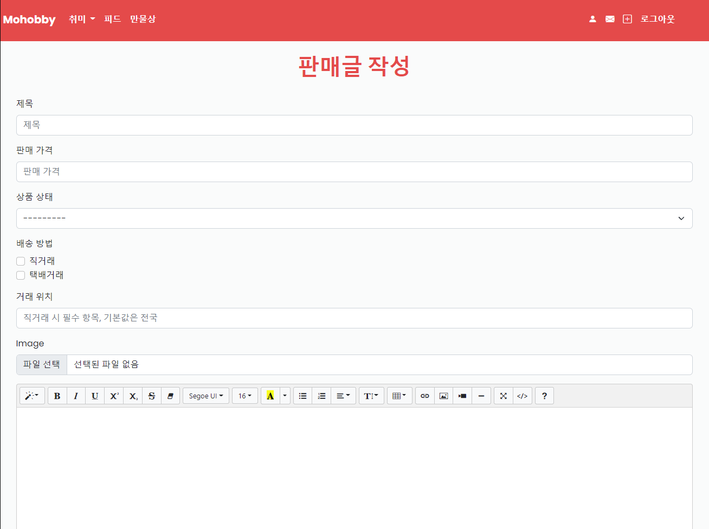
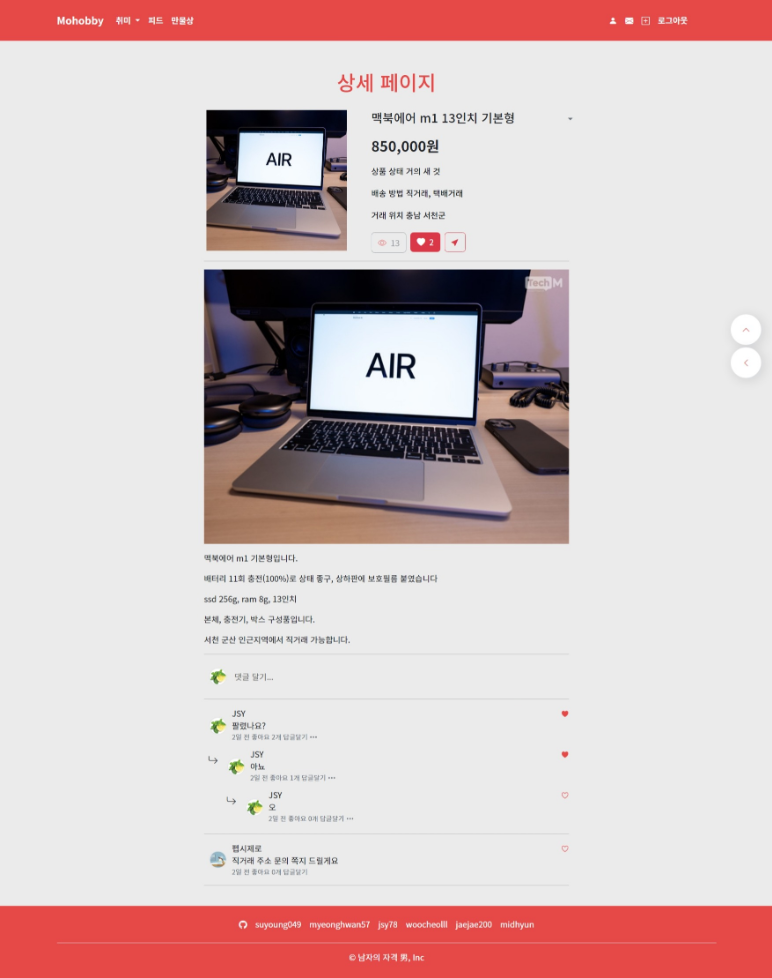
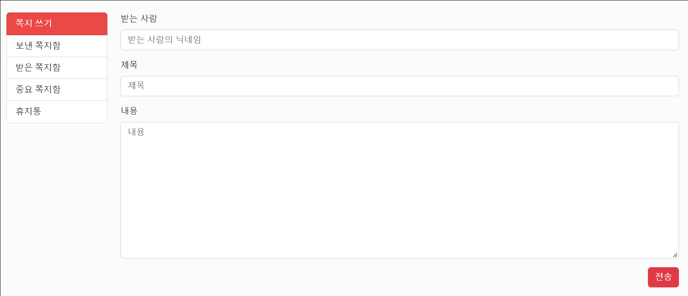

# KDTFinalPJT 📖

> 남자의 자격 팀의 취미를 위한 A to Z 플랫폼

 

<!-- Badge -->

     
 
　
　　
 
　　 　

 

## **📅 일정**

- **2022.11.24 ~ 2022.12.14**
- 사이트 주소 : http://mohobby-env.eba-v2kvw9tu.ap-northeast-2.elasticbeanstalk.com/

 

# 😁**프로젝트 소개**

남자라면, 사람이라면 누구나 눈치 보지 않고 즐길 수 있는 건전한 취미가 필요하다.

취미의 A to Z 놀면 **Mohobby**??

만인의 취미 **만취**! 이곳에서 당신의 취미를 함께하라.

## **🧑‍💻 개발팀**

 

 
 

| 이름   | 역할       |
| ------ | ---------- |
| 김현중 | Full-Stack |
| 이수영 | Full-Stack |
| 신우철 | Full-Stack |
| 조성윤 | Full-Stack |
| 김명환 | Full-Stack |
| 김재우 | Full-Stack |

---

## **WEB**

접기/펼치기

### **1. Hobby_Create**

- Create 페이지에서는 서비스에서 소셜링을 모집하기 위한 글을 작성을 `멀티스텝 폼`형식으로 구현하였습니다.
- 각 `Step`마다 입력을 받음으로써 많은 입력을 받아야 할 때 UX를 개선시켰습니다.
- 카테고리별 태그선택(직접입력)이 가능하며, 제목, 날짜 등을 입력받습니다.
- 모임 장소의 경우 온라인과 오프라인으로 나뉘며, 오프라인의 경우 Kakao API를 사용해 검색결과를 출력하였습니다.

---

 

### **2. Hobby_detail**

- detail 페이지에서는 모임에 필요한 정보를 한눈에 볼 수 있도록 구현하였습니다.
- 또한 모바일에 최적화된 화면으로 구성하였습니다.
- 리뷰 작성은 어디서든 작성할 수 있게 `하단에 작성하기 버튼`을 추가하였습니다.
- 제한된 인원까지 호스트가 승인할 수 있으며, 신청의 경우 제한인원과 상관없이 대기 멤버에 등록됩니다.
- 모임의 장소가 오프라인일 경우 지도 API를 사용하여 지도에 상세위치를 구현했습니다.
- 댓글의 경우 `비동기`로 답글과 좋아요 기능을 추가했으며, 디테일페이지의 `UI/UX`를 크게 해치지 않도록 일부 댓글만 보여주며, 전체 댓글은 아이콘 클릭 시 offcanvas 형태로 나타나도록 구현하였습니다.

---

 

### **3. Accounts**

- 회원가입, 카카오 로그인
  - 필수정보를 입력해야만 가입가능
  - 멀티스텝 폼
  - recaptcha - ‘로봇이 아닙니다’ 체크해야만 가입 가능
- 디테일 페이지
  - 유저가 작성한 글들을 카테고리별로 확인
  - 선택한 취미를 클릭하여 해당하는 소셜링을 찾아볼 수 있음
  - 팔로잉, 팔로워, 차단목록과 메시지까지 유저 관계를 한눈에 확인할 수 있음
- 메시지 기능
  - 쪽지

- 회원가입, 카카오 로그인
  - 필수정보를 입력해야만 가입가능
  - 멀티스텝 폼
  - recaptcha - ‘로봇이 아닙니다’ 체크해야만 가입 가능
- 디테일 페이지
  - 유저가 작성한 글들을 카테고리별로 확인
  - 선택한 취미를 클릭하여 해당하는 소셜링을 찾아볼 수 있음
  - 팔로잉, 팔로워, 차단목록과 메시지까지 유저 관계를 한눈에 확인할 수 있음
- 메시지 기능
  - 쪽지

## 4. Products

- 모든 취미관련 물품 거래를 위한 만물상
  - 거래글을 작성하면 유저간 거래가 가능함
- 중고거래 CREATE, UPDATE
  - 제목 (CharField)
  - 판매 가격 (BigIntegerField)
  - 상품 상태 (사용감 있음, 거의 새 것, 미개봉 중 하나 선택)
  - 배송 방법 (직거래, 택배거래 중복 선택 가능)
  - 거래 위치 (다음 주소 API 적용, 시도와 시군구 정보를 가져옴)
  - 이미지 (ProcessedImageField)
  - 내용 (django-summernote 텍스트 에디터 적용)
- 중고거래 READ, DELETE
  - 글 목록 페이지에 card hover 효과, 페이지네이션 , 검색 기능 적용
  - 글 작성 시 업로드 했던 이미지 표시
  - 글 제목, 상품 상태, 배송 방법, 거래 위치 표시
  - 가격 표시 (humanize intcomma 태그로 3자리마다 콤마를 찍어서 표현)
  - 조회수 표시 (쿠키를 사용해서 하루에 한 번씩 조회수 증가)
  - 좋아요(찜) 기능 (찜 횟수 표시, 비동기 처리)
  - 쪽지 보내기 기능 (글 작성자의 닉네임으로 쪽지를 보냄)
  - 본인의 게시글일 경우 우측 드롭다운 버튼으로 수정, 삭제 가능
  - summernote로 작성한 내용을 safe 태그로 표시
  - 댓글, 대댓글, 댓글 좋아요 기능 (비동기 처리)

## 5.Notes

- 쪽지 CREATE
  - 받는 쪽지, 보낸 쪽지 2개의 모델 생성 후 OneToOneField로 일대일 대응
  - 받는 사람의 닉네임 (CharField)
  - 제목 (CharField)
  - 내용 (TextField)
- 쪽지 READ, DELETE
  - 보낸 쪽지함에서 본인이 송신한 쪽지 목록 확인 가능
  - 보낸 쪽지함에서 본인이 보낸 쪽지를 삭제 가능 (상대방이 받은 쪽지 정보는 삭제되지 않음)
  - 받은 쪽지함에서 본인이 수신한 쪽지 목록 확인 가능
  - 받았지만 읽지 않은 쪽지를 확인하면 수신 여부가 업데이트됨 (쪽지 송신자가 수신 여부를 확인 가능)
  - 받은 쪽지함에서 쪽지를 중요 쪽지함 또는 휴지통으로 이동 가능
  - 중요 쪽지함에서는 쪽지 삭제가 불가능
  - 휴지통에서는 쪽지를 다시 되돌리거나 삭제할 수 있음 (상대방이 보냈던 쪽지 정보는 삭제되지 않음)
  - 쪽지에는 보낸 사람의 닉네임, 받은 사람의 닉네임, 제목, 내용, 송신 날짜, 수신 여부 정보가 있음

 

## **🎮 주요 기능**

 

| 표기      | 설명                |
| --------- | ------------------- |
| 진한 글씨 | 타이틀 및 중요도    |
| 🖐        | 선택 기능(완료 : ✔) |
| 📌        | 분기 처리 및 참조   |

---

## **🧩 DB 설계**

---

## **🚀 View 설계**

---

## **📖 서비스 소개**

 

