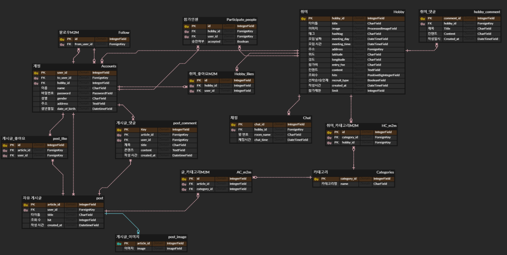

# KDTFinalPJT 📖

> 남자의 자격 팀의 취미를 위한 A to Z 플랫폼


<br/>

<!-- Badge -->

     
<br>
　
　
<br>
　 　

<br/>

## **📅 일정**

- **2022.11.24 ~ 2022.12.14**
- 사이트 주소 : http://mohobby-env.eba-v2kvw9tu.ap-northeast-2.elasticbeanstalk.com/

<br />

# 😁**프로젝트 소개**

남자라면, 사람이라면 누구나 눈치 보지 않고 즐길 수 있는 건전한 취미가 필요하다.

취미의 A to Z 놀면 **Mohobby**??

만인의 취미 **만취**! 이곳에서 당신의 취미를 함께하라.

## **🧑‍💻 개발팀**

<br />

<a href="https://github.com/midhyun/Mohobby/graphs/contributors">
  
</a>

<br/>
<br/>

| 이름   | 역할       |
| ------ | ---------- |
| 김현중 | Full-Stack |
| 이수영 | Full-Stack |
| 신우철 | Full-Stack |
| 조성윤 | Full-Stack |
| 김명환 | Full-Stack |
| 김재우 | Full-Stack |

---

## **WEB**

<details>
<summary>접기/펼치기</summary>


### **1. Hobby_Create**

- Create 페이지에서는 서비스에서 소셜링을 모집하기 위한 글을 작성을 `멀티스텝 폼`형식으로 구현하였습니다.
- 각 `Step`마다 입력을 받음으로써 많은 입력을 받아야 할 때 UX를 개선시켰습니다.
- 카테고리별 태그선택(직접입력)이 가능하며, 제목, 날짜 등을 입력받습니다.
- 모임 장소의 경우 온라인과 오프라인으로 나뉘며, 오프라인의 경우 Kakao API를 사용해 검색결과를 출력하였습니다.


---

<br />

### **2. Hobby_detail**

- detail 페이지에서는 모임에 필요한 정보를 한눈에 볼 수 있도록 구현하였습니다.
- 또한 모바일에 최적화된 화면으로 구성하였습니다.
- 리뷰 작성은 어디서든 작성할 수 있게 `하단에 작성하기 버튼`을 추가하였습니다.
- 제한된 인원까지 호스트가 승인할 수 있으며, 신청의 경우 제한인원과 상관없이 대기 멤버에 등록됩니다.
- 모임의 장소가 오프라인일 경우 지도 API를 사용하여 지도에 상세위치를 구현했습니다.
- 댓글의 경우 `비동기`로 답글과 좋아요 기능을 추가했으며, 디테일페이지의 `UI/UX`를 크게 해치지 않도록 일부 댓글만 보여주며, 전체 댓글은 아이콘 클릭 시 offcanvas 형태로 나타나도록 구현하였습니다.


---

<br />

### **3. Accounts**

- 회원가입, 카카오 로그인
  - 필수정보를 입력해야만 가입가능
  - 멀티스텝 폼
  - recaptcha - ‘로봇이 아닙니다’ 체크해야만 가입 가능
- 디테일 페이지
  - 유저가 작성한 글들을 카테고리별로 확인
  - 선택한 취미를 클릭하여 해당하는 소셜링을 찾아볼 수 있음
  - 팔로잉, 팔로워, 차단목록과 메시지까지 유저 관계를 한눈에 확인할 수 있음
- 메시지 기능
  - 쪽지

- 회원가입, 카카오 로그인
  - 필수정보를 입력해야만 가입가능
  - 멀티스텝 폼
  - recaptcha - ‘로봇이 아닙니다’ 체크해야만 가입 가능
- 디테일 페이지
  - 유저가 작성한 글들을 카테고리별로 확인
  - 선택한 취미를 클릭하여 해당하는 소셜링을 찾아볼 수 있음
  - 팔로잉, 팔로워, 차단목록과 메시지까지 유저 관계를 한눈에 확인할 수 있음
- 메시지 기능
  - 쪽지


## 4. Products

- 모든 취미관련 물품 거래를 위한 만물상
  - 거래글을 작성하면 유저간 거래가 가능함
- 중고거래 CREATE, UPDATE
  - 제목 (CharField)
  - 판매 가격 (BigIntegerField)
  - 상품 상태 (사용감 있음, 거의 새 것, 미개봉 중 하나 선택)
  - 배송 방법 (직거래, 택배거래 중복 선택 가능)
  - 거래 위치 (다음 주소 API 적용, 시도와 시군구 정보를 가져옴)
  - 이미지 (ProcessedImageField)
  - 내용 (django-summernote 텍스트 에디터 적용)
- 중고거래 READ, DELETE
  - 글 목록 페이지에 card hover 효과, 페이지네이션 , 검색 기능 적용
  - 글 작성 시 업로드 했던 이미지 표시
  - 글 제목, 상품 상태, 배송 방법, 거래 위치 표시
  - 가격 표시 (humanize intcomma 태그로 3자리마다 콤마를 찍어서 표현)
  - 조회수 표시 (쿠키를 사용해서 하루에 한 번씩 조회수 증가)
  - 좋아요(찜) 기능 (찜 횟수 표시, 비동기 처리)
  - 쪽지 보내기 기능 (글 작성자의 닉네임으로 쪽지를 보냄)
  - 본인의 게시글일 경우 우측 드롭다운 버튼으로 수정, 삭제 가능
  - summernote로 작성한 내용을 safe 태그로 표시
  - 댓글, 대댓글, 댓글 좋아요 기능 (비동기 처리)


## 5.Notes

- 쪽지 CREATE
  - 받는 쪽지, 보낸 쪽지 2개의 모델 생성 후 OneToOneField로 일대일 대응
  - 받는 사람의 닉네임 (CharField)
  - 제목 (CharField)
  - 내용 (TextField)
- 쪽지 READ, DELETE
  - 보낸 쪽지함에서 본인이 송신한 쪽지 목록 확인 가능
  - 보낸 쪽지함에서 본인이 보낸 쪽지를 삭제 가능 (상대방이 받은 쪽지 정보는 삭제되지 않음)
  - 받은 쪽지함에서 본인이 수신한 쪽지 목록 확인 가능
  - 받았지만 읽지 않은 쪽지를 확인하면 수신 여부가 업데이트됨 (쪽지 송신자가 수신 여부를 확인 가능)
  - 받은 쪽지함에서 쪽지를 중요 쪽지함 또는 휴지통으로 이동 가능
  - 중요 쪽지함에서는 쪽지 삭제가 불가능
  - 휴지통에서는 쪽지를 다시 되돌리거나 삭제할 수 있음 (상대방이 보냈던 쪽지 정보는 삭제되지 않음)
  - 쪽지에는 보낸 사람의 닉네임, 받은 사람의 닉네임, 제목, 내용, 송신 날짜, 수신 여부 정보가 있음


<br />

</details>

## **🎮 주요 기능**

<br/>

| 표기      | 설명                |
| --------- | ------------------- |
| 진한 글씨 | 타이틀 및 중요도    |
| 🖐        | 선택 기능(완료 : ✔) |
| 📌        | 분기 처리 및 참조   |

---

## **🧩 DB 설계**




---

## **🚀 View 설계**

<details>
<summary>접기/펼치기</summary>

### Hobby

```python
class Categories(models.Model):
    category = models.CharField(max_length=20)

class Hobby(models.Model):
    host = models.ForeignKey(settings.AUTH_USER_MODEL, on_delete=models.CASCADE, related_name='Hobby')
    title = models.CharField(max_length=80)
    category = models.CharField(max_length=20)
    tags = models.CharField(max_length=80)
    created_at = models.DateTimeField(auto_now_add=True)
    meeting_day = models.DateTimeField()
    address_type = models.BooleanField(default=False) # False=오프라인, True=온라인
    address = models.CharField(max_length=100, default='온라인') # 온라인 or 오프라인 주소
    X = models.CharField(max_length=30, null=True, blank=True)
    Y = models.CharField(max_length=30, null=True, blank=True)
    entry_fee = models.CharField(max_length=20, null=True, blank=True)
    content = models.TextField(null=True, blank=True)
    hits = models.PositiveBigIntegerField(default=0)
    recruit_type = models.BooleanField(default=False) # 자유가입(False), 승인제(True)
    limit = models.IntegerField(default=3, validators=[MinValueValidator(3), MaxValueValidator(15)])
    members = models.ManyToManyField(settings.AUTH_USER_MODEL, through='Accepted')
    image = models.ImageField(
        upload_to="images/",
        blank=True,
    )
    image_thumbnail = ImageSpecField(
        source="image",
        processors=[ResizeToFill(300, 300)],
        format="JPEG",
        options={"quality": 80},
    )
    like_user = models.ManyToManyField(settings.AUTH_USER_MODEL, related_name='like_hobby')

class Accepted(models.Model):
    joindate = models.DateTimeField(auto_now=True)
    hobby = models.ForeignKey(Hobby, on_delete=models.CASCADE, related_name='accepted')
    user = models.ForeignKey(settings.AUTH_USER_MODEL, on_delete=models.CASCADE)
    joined = models.BooleanField(default=False) # 승인여부

class Tag(models.Model):
    tag = models.CharField(max_length=20, unique=True)
    category = models.CharField(max_length=20, null=True) 

class HobbyComment(models.Model):
    user = models.ForeignKey(settings.AUTH_USER_MODEL, on_delete=models.CASCADE)
    hobby = models.ForeignKey(Hobby, on_delete=models.CASCADE, related_name='comments')
    content = models.TextField()
    created_at = models.DateTimeField(auto_now_add=True)
    like_user = models.ManyToManyField(settings.AUTH_USER_MODEL, related_name='like_comment')
    parent = models.ForeignKey('self', on_delete=models.CASCADE, null=True, related_name='recomment')
```

### Accounts

```python
class User(AbstractUser):
    GENDER_CHOICES = (
        ("M", "남자"),
        ("F", "여자"),
    )
    gender = models.CharField(  # 성별
        max_length=2,
        choices=GENDER_CHOICES,
    )
    address = models.CharField(max_length=50)  # 주소
    address_detail = models.CharField(max_length=40, null=True, blank=True)  # 상세주소
    birth = models.DateTimeField(default=timezone.now)  # 나이
    nickname = models.CharField(null=True, unique=True, max_length=20)
    kakao_id = models.CharField(null=True, unique=True, max_length=100)
    followings = models.ManyToManyField("self", symmetrical=False, related_name="followers")
    blocking = models.ManyToManyField(
        "self", symmetrical=False, related_name="blockers"
    )

    image = ProcessedImageField(
        upload_to="image/",
        format="JPEG",
        processors = [
            Transpose(),
        ],
        options={"quality": 30},
        blank=True,
        null=True,
    )
    received_mail = models.IntegerField(default=0, null=True)

    STORTS_CHOICES = (
        ("축구", "축구"),
        ("농구", "농구"),
        ("야구", "야구"),
        ("클라이밍", "클라이밍"),
        ("등산", "등산"),
        ("테니스", "테니스"),
        ("트래킹", "트래킹"),
        ("볼링", "볼링"),
        ("러닝", "러닝"),
        ("스키", "스키"),
        ("보드", "보드"),
        ("헬스", "헬스"),
        ("산책", "산책"),
        ("플로깅", "플로깅"),
        ("자전거", "자전거"),
        ("서핑", "서핑"),
        ("배드민턴", "배드민턴"),
        ("탁구", "탁구"),
        ("골프", "골프"),
        ("스포츠경기", "스포츠경기"),
    )

    sports = MultiSelectField(  # 관심 운동 선택
        max_length=100,
        choices=STORTS_CHOICES,
        blank=True,
    )

    Travel_CHOICES = (
        ("복합문화공간", "복합문화공간"),
        ("테마파크", "테마파크"),
        ("피크닉", "피크닉"),
        ("드라이브", "드라이브"),
        ("캠핑", "캠핑"),
        ("국내여행", "국내여행"),
        ("해외여행", "해외여행"),
    )

    travel = MultiSelectField(  # 관심 여행 나들이 선택
        max_length=100,
        choices=Travel_CHOICES,
        blank=True,
    )

    ART_CHOICES = (
        ("전시", "전시"),
        ("영화", "영화"),
        ("뮤지컬", "뮤지컬"),
        ("공연", "공연"),
        ("디자인", "디자인"),
        ("박물관", "박물관"),
        ("연극", "연극"),
        ("콘서트", "콘서트"),
        ("연주회", "연주회"),
        ("페스티벌", "페스티벌"),
    )

    art = MultiSelectField(  # 관심 문화*예술 선택
        max_length=100,
        choices=ART_CHOICES,
        blank=True,
    )

    FOOD_CHOICES = (
        ("맛집투어", "맛집투어"),
        ("카페", "카페"),
        ("와인", "와인"),
        ("커피", "커피"),
        ("디저트", "디저트"),
        ("맥주", "맥주"),
        ("티룸", "티룸"),
        ("비건", "비건"),
        ("파인다이닝", "파인다이닝"),
        ("요리", "요리"),
        ("페어링", "페어링"),
        ("칵테일", "칵테일"),
        ("위스키", "위스키"),
        ("전통주", "전통주"),
    )

    food = MultiSelectField(  # 관심 음식 선택
        max_length=100,
        choices=FOOD_CHOICES,
        blank=True,
    )

    DEVELOP_CHOICES = (
        ("습관만들기", "습관만들기"),
        ("챌린지", "챌린지"),
        ("독서", "독서"),
        ("스터디", "스터디"),
        ("외국어", "외국어"),
        ("재테크", "재테크"),
        ("브랜딩", "브랜딩"),
        ("커리어", "커리어"),
        ("사이드프로젝트", "사이드프로젝트"),
    )

    develop = MultiSelectField(max_length=100, choices=DEVELOP_CHOICES, blank=True)  # 관심 음식 선택

    @property
    def get_photo_url(self):

        if self.profile_pic:
            return self.profile_pic.url
        return None
```

### Community

```python
class Community(models.Model):
    user = models.ForeignKey(settings.AUTH_USER_MODEL, on_delete=models.CASCADE, default="")
    title = models.CharField(max_length=50)
    content = models.TextField()
    created_at = models.DateTimeField(auto_now_add=True)
    like = models.ManyToManyField(settings.AUTH_USER_MODEL, related_name="like_community")
    hits = models.PositiveBigIntegerField(default=1, verbose_name="조회수")
    def summary(self):
        return self.content[:80]


# 댓글 부분
class Comment(models.Model):
    content = models.CharField(max_length=300)
    created_at = models.DateTimeField(auto_now_add=True)
    posting = models.ForeignKey(Community, on_delete=models.CASCADE)
    user = models.ForeignKey(settings.AUTH_USER_MODEL, on_delete=models.CASCADE)
    like = models.ManyToManyField(settings.AUTH_USER_MODEL, related_name="like_community_comment")
    # 대댓글
    parent_comment = models.ForeignKey("self", on_delete=models.CASCADE, related_name="recomment", null=True)


class Photo(models.Model):
    post = models.ForeignKey(Community, on_delete=models.CASCADE, null=True)
    image = models.ImageField(upload_to="images/", blank=True, null=True)

```

### Products

```python
class Product(models.Model):
    user = models.ForeignKey(settings.AUTH_USER_MODEL, on_delete=models.CASCADE)
    title = models.CharField(max_length=80)
    price = models.BigIntegerField()
    product_category = (
        ("사용감 있음", "사용감 있음"),
        ("거의 새 것", "거의 새 것"),
        ("미개봉", "미개봉"),
    )
    productType = models.CharField(max_length=20, choices=product_category, null=True)
    trade_category = (
        ("직거래", "직거래"),
        ("택배거래", "택배거래"),
    )
    tradeType = MultiSelectField(max_length=10, choices=trade_category, min_choices=1, max_choices=2)
    location = models.CharField(max_length=80, blank=True)
    image = ProcessedImageField(
        upload_to="images/product",
        blank=False,
        processors=[ResizeToFill(1200, 1200)],
        format="JPEG",
        options={"quality": 95},
        default="default.jpg",
    )
    thumbnail = ImageSpecField(
        source="image",
        processors=[Thumbnail(200, 200)],
        format="JPEG",
    )
    content = models.TextField()
    contentStripTag = models.TextField()
    created_at = models.DateTimeField(auto_now_add=True)
    updated_at = models.DateTimeField(auto_now=True)
    is_updated = models.BooleanField(default=False)
    like_users = models.ManyToManyField(settings.AUTH_USER_MODEL, related_name="like_product")
    hits = models.PositiveBigIntegerField(default=0, verbose_name="조회수")

    @property
    def created_at_string(self):
        time = datetime.now(tz=timezone.utc) - self.created_at

        if time < timedelta(minutes=1):
            return "방금 전"
        elif time < timedelta(hours=1):
            return str(int(time.seconds / 60)) + "분 전"
        elif time < timedelta(days=1):
            return str(int(time.seconds / 3600)) + "시간 전"
        elif time < timedelta(days=7):
            time = datetime.now(tz=timezone.utc).date() - self.created_at.date()
            return str(time.days) + "일 전"
        else:
            return self.created_at.astimezone(timezone(timedelta(hours=9))).strftime("%Y-%m-%d %H:%M")

    @property
    def updated_at_string(self):
        time = datetime.now(tz=timezone.utc) - self.updated_at

        if time < timedelta(minutes=1):
            return "방금 전"
        elif time < timedelta(hours=1):
            return str(int(time.seconds / 60)) + "분 전"
        elif time < timedelta(days=1):
            return str(int(time.seconds / 3600)) + "시간 전"
        elif time < timedelta(days=7):
            time = datetime.now(tz=timezone.utc).date() - self.updated_at.date()
            return str(time.days) + "일 전"
        else:
            return self.updated_at.astimezone(timezone(timedelta(hours=9))).strftime("%Y-%m-%d %H:%M")


class Product_Comment(models.Model):
    user = models.ForeignKey(settings.AUTH_USER_MODEL, on_delete=models.CASCADE)
    product = models.ForeignKey(Product, on_delete=models.CASCADE)
    content = models.CharField(max_length=80)
    created_at = models.DateTimeField(auto_now_add=True)
    updated_at = models.DateTimeField(auto_now=True)
    parent = models.ForeignKey(
        "self",
        related_name="reply_set",
        on_delete=models.CASCADE,
        null=True,
        blank=True,
    )
    like_users = models.ManyToManyField(settings.AUTH_USER_MODEL, related_name="like_product_comment")

    @property
    def created_at_string(self):
        time = datetime.now(tz=timezone.utc) - self.created_at

        if time < timedelta(minutes=1):
            return "방금 전"
        elif time < timedelta(hours=1):
            return str(int(time.seconds / 60)) + "분 전"
        elif time < timedelta(days=1):
            return str(int(time.seconds / 3600)) + "시간 전"
        elif time < timedelta(days=7):
            time = datetime.now(tz=timezone.utc).date() - self.created_at.date()
            return str(time.days) + "일 전"
        else:
            return self.created_at.astimezone(timezone(timedelta(hours=9))).strftime("%Y-%m-%d %H:%M")

    @property
    def updated_at_string(self):
        time = datetime.now(tz=timezone.utc) - self.updated_at

        if time < timedelta(minutes=1):
            return "방금 전"
        elif time < timedelta(hours=1):
            return str(int(time.seconds / 60)) + "분 전"
        elif time < timedelta(days=1):
            return str(int(time.seconds / 3600)) + "시간 전"
        elif time < timedelta(days=7):
            time = datetime.now(tz=timezone.utc).date() - self.updated_at.date()
            return str(time.days) + "일 전"
        else:
            return self.updated_at.astimezone(timezone(timedelta(hours=9))).strftime("%Y-%m-%d %H:%M")
```

</details>
